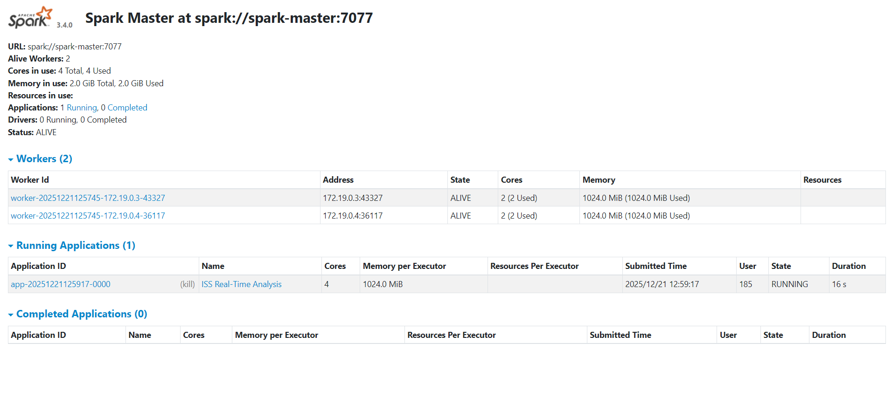
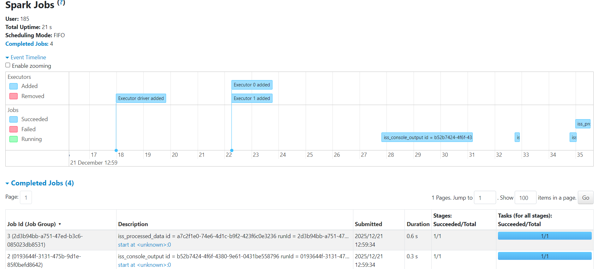
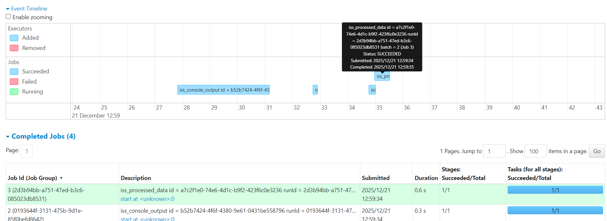

# ISS Real-Time Analysis with Apache Spark

## Project Overview

Project of **Thibault GAREL** and **Alexandre GARREAU** !

We take Option A - Technical Project :

This project demonstrates **real-time analysis of International Space Station (ISS) position data** using **Apache Spark Structured Streaming**. It continuously fetches ISS position from the Open Notify API, processes the data in real-time using Spark, and generates insights such as velocity, position tracking, and statistical aggregations.

**_`🏆We can see that it works ! We calculate the distance to paris, the orbit phase and the hemisphere !!!🏆`_**

---

## Why Apache Spark?

I selected **Apache Spark** for this Big Data project because:

1. **Unified Streaming and Batch Processing**
2. **Fault Tolerance**
3. **Scalability**
4. **Built-in Aggregations**
5. **Real-World Relevance**

We found a **perfect Notify API about ISS**, so we choose this use-case !

---

## Architecture

```
┌─────────────────┐
│  Open Notify    │
│  API (ISS Data) │
└────────┬────────┘
         │
         │ HTTP Request (every 5s)
         │
         ▼
┌─────────────────────────┐
│  Data Generator         │
│  (Python Script)        │
│  - Fetches ISS position │
│  - Calculates velocity  │
│  - Writes JSON files    │
└────────┬────────────────┘
         │
         │ JSON Files
         │
         ▼
┌─────────────────────────────────────┐
│  Spark Structured Streaming         │
│  ┌──────────────────────────────┐   │
│  │  1. Read Stream (JSON)       │   │
│  └──────────┬───────────────────┘   │
│             │                       │
│             ▼                       │
│  ┌──────────────────────────────┐   │
│  │  2. Process & Transform      │   │
│  │     - Parse coordinates      │   │
│  │     - Add hemisphere info    │   │
│  │     - Calculate metrics      │   │
│  └──────────┬───────────────────┘   │
│             │                       │
│             ▼                       │
│  ┌──────────────────────────────┐   │
│  │  3. Windowed Aggregations    │   │
│  │     - 1-minute windows       │   │
│  │     - Avg/Max/Min velocity   │   │
│  │     - Position statistics    │   │
│  └──────────┬───────────────────┘   │
│             │                       │
└─────────────┼───────────────────────┘
              │
              ├─────────────────────┐
              │                     │
              ▼                     ▼
     ┌────────────────┐    ┌───────────────┐
     │ Processed Data │    │  Statistics   │
     │ (JSON files)   │    │ (JSON files)  │
     └────────────────┘    └───────────────┘
     
(schema by Claude AI)
```

---

## Project Structure

```
ISS_analysis_in_real_time/
├── docker-compose.yml          # Spark cluster configuration
├── requirements.txt            # Python dependencies
├── .gitignore                  # Git ignore patterns
├── README.md                   # This file
│
├── src/
│   ├── utils/
│   │   ├── __init__.py
│   │   └── iss_data_fetcher.py      # ISS API client
│   │
│   └── streaming/
│       ├── iss_data_generator.py     # Data stream generator
│       └── iss_spark_streaming.py    # Spark Streaming app
│
├── data/
│   ├── raw/                          # Raw ISS position data
│   └── processed/                    # Processed results
│       ├── processed/                # Processed streaming data
│       └── statistics/               # Windowed statistics
│
├── logs/                             # Application logs
```

---

## Installation Steps

### Prerequisites

- **Docker** and **Docker Compose** installed
- **Python 3.8+** installed (for local data generator)
- **Git** for version control

### Step 1: Clone the Repository

```bash
git clone <repository-url>
cd ISS_analysis_in_real_time
```

### Step 2: Install Python Dependencies (Local)

```bash
# Create virtual environment
python3 -m venv venv
source venv/bin/activate  # On Windows: venv\Scripts\activate

# Install dependencies
pip install -r requirements.txt
```

### Step 3: Start Spark Cluster with Docker

Don't forget to open docker and have already spark :


```bash
# If necessary 
docker-compose down
rm -rf data/raw/* data/processed/* logs/*

# Start all services (Spark Master + 2 Workers)
docker-compose up -d

# Verify cluster is running
docker-compose ps
```

**Expected output:**
```
NAME                 IMAGE                    COMMAND                  SERVICE          CREATED         STATUS         PORTS
iss-spark-master     apache/spark-py:latest   "/opt/entrypoint.sh …"   spark-master     7 seconds ago   Up 5 seconds   0.0.0.0:4040->4040/tcp, [::]:4040->4040/tcp, 0.0.0.0:7077->7077/tcp, [::]:7077->7077/tcp, 0.0.0.0:8080->8080/tcp, [::]:8080->8080/tcp
iss-spark-worker-1   apache/spark-py:latest   "/opt/entrypoint.sh …"   spark-worker-1   7 seconds ago   Up 5 seconds
iss-spark-worker-2   apache/spark-py:latest   "/opt/entrypoint.sh …"   spark-worker-2   7 seconds ago   Up 5 seconds
```

### Step 4: Access Spark Web UIs

- **Spark Master UI**: http://localhost:8080
- **Spark Application UI**: http://localhost:4040 (when job is running)

🚨Attention, the Spark Application UI and the job is really fast to run, so you have to open it during the process (Add more iteration if you want : `--duration 60` ==>  `--duration 120`)🚨

---

## Running the Application

### Manual Execution

#### Step 1: Generate ISS Data Stream

In a **🚨first terminal🚨**:

```bash
# Activate virtual environment if you are not in venv
source venv/bin/activate

# Run data generator (fetches ISS position every 5 seconds for 5 minutes)
python src/streaming/iss_data_generator.py --output data/raw --interval 5 --duration 50
```

**Sample output:**
```
Starting ISS data stream generator...
Writing to: data/raw
Fetch interval: 5 seconds
Duration: 50 seconds
------------------------------------------------------------
[1] Position: (-15.3681, 6.4226) | Velocity: 0.0000 km/s | File: iss_data_20251221_135846_216144.json
[2] Position: (-15.6155, 6.6177) | Velocity: 6.9104 km/s | File: iss_data_20251221_135851_524354.json
[3] Position: (-15.9368, 6.8722) | Velocity: 6.4175 km/s | File: iss_data_20251221_135857_874322.json
[4] Position: (-16.2085, 7.0882) | Velocity: 7.6037 km/s | File: iss_data_20251221_135903_227977.json
[5] Position: (-16.4798, 7.3049) | Velocity: 6.3349 km/s | File: iss_data_20251221_135908_579709.json
[6] Position: (-16.8740, 7.6212) | Velocity: 6.9107 km/s | File: iss_data_20251221_135916_938976.json
[7] Position: (-17.1446, 7.8396) | Velocity: 7.6017 km/s | File: iss_data_20251221_135922_256197.json
[8] Position: (-17.4395, 8.0786) | Velocity: 6.9104 km/s | File: iss_data_20251221_135928_583236.json
[9] Position: (-17.7096, 8.2984) | Velocity: 6.3353 km/s | File: iss_data_20251221_135933_919210.json
------------------------------------------------------------
Stream generation completed!
Total data points: 9
Elapsed time: 53.07 seconds
Average rate: 0.17 points/second
```

#### Step 2: Run Spark Streaming Application

In a **🚨second terminal🚨** in the same time:

```bash
# Submit Spark job to the cluster
docker exec -it iss-spark-master /opt/spark/bin/spark-submit `
    --master spark://spark-master:7077 `
    --deploy-mode client `
    /opt/spark-apps/streaming/iss_spark_streaming.py `
    --input /opt/spark-data/raw `
    --output /opt/spark-data/processed
```

**Sample output:**
Many information ... then:
```
--------------------------------------------------------------------------------
Streaming queries are running... Press Ctrl+C to stop
================================================================================
-------------------------------------------
Batch: 0
-------------------------------------------
+-------------------+--------+---------+-------------+--------------------+-----------+-------------+-------------+
|event_time         |latitude|longitude|velocity_km_s|distance_to_paris_km|orbit_phase|hemisphere_ns|hemisphere_ew|
+-------------------+--------+---------+-------------+--------------------+-----------+-------------+-------------+
|2025-12-21 12:58:51|-15.6155|6.6177   |6.9104       |7181.36             |DESCENDING |South        |East         |
|2025-12-21 12:58:58|-15.9368|6.8722   |6.4175       |7218.55             |DESCENDING |South        |East         |
|2025-12-21 12:59:03|-16.2085|7.0882   |7.6037       |7250.06             |DESCENDING |South        |East         |
|2025-12-21 12:59:09|-16.4798|7.3049   |6.3349       |7281.58             |DESCENDING |South        |East         |
|2025-12-21 12:59:22|-17.1446|7.8396   |7.6017       |7359.08             |DESCENDING |South        |East         |
|2025-12-21 12:59:17|-16.874 |7.6212   |6.9107       |7327.49             |DESCENDING |South        |East         |
|2025-12-21 12:58:46|-15.3681|6.4226   |0.0          |7152.78             |UNKNOWN    |South        |East         |
|2025-12-21 12:36:01|46.8288 |-57.9893 |6.3365       |null                |null       |North        |West         |
|2025-12-21 12:36:06|46.6782 |-57.5411 |7.6062       |null                |null       |North        |West         |
|2025-12-21 12:36:11|46.5396 |-57.1361 |6.9127       |null                |null       |North        |West         |
|2025-12-21 12:36:17|46.3854 |-56.693  |6.3374       |null                |null       |North        |West         |
|2025-12-21 12:35:47|47.19   |-59.1003 |7.1298       |null                |null       |North        |West         |
|2025-12-21 12:35:55|46.9774 |-58.44   |6.9128       |null                |null       |North        |West         |
|2025-12-21 12:35:31|47.6153 |-60.4797 |0.0          |null                |null       |North        |West         |
+-------------------+--------+---------+-------------+--------------------+-----------+-------------+-------------+

-------------------------------------------
Batch: 1
-------------------------------------------
+-------------------+--------+---------+-------------+--------------------+-----------+-------------+-------------+
|event_time         |latitude|longitude|velocity_km_s|distance_to_paris_km|orbit_phase|hemisphere_ns|hemisphere_ew|
+-------------------+--------+---------+-------------+--------------------+-----------+-------------+-------------+
|2025-12-21 12:59:28|-17.4395|8.0786   |6.9104       |7393.57             |DESCENDING |South        |East         |
+-------------------+--------+---------+-------------+--------------------+-----------+-------------+-------------+

-------------------------------------------
Batch: 2
-------------------------------------------
+-------------------+--------+---------+-------------+--------------------+-----------+-------------+-------------+
|event_time         |latitude|longitude|velocity_km_s|distance_to_paris_km|orbit_phase|hemisphere_ns|hemisphere_ew|
+-------------------+--------+---------+-------------+--------------------+-----------+-------------+-------------+
|2025-12-21 12:59:34|-17.7096|8.2984   |6.3353       |7425.22             |DESCENDING |South        |East         |
+-------------------+--------+---------+-------------+--------------------+-----------+-------------+-------------+
```

## **_`🏆We can see that it works ! We calculate the distance to paris, the orbit phase and the hemisphere !!!🏆`_**


---

## Minimal Working Example

### Input Data (ISS Position JSON)

```json
{
  "latitude": 47.6153,
  "longitude": -60.4797,
  "timestamp": 1766320531,
  "fetch_time": "2025-12-21T13:35:30.588242",
  "altitude_km": 408.0,
  "velocity_km_s": 0.0
}
```

### Processed Output

```json
{
  "latitude":46.9774,
  "longitude":-58.44,
  "timestamp":1766320555,
  "fetch_time":"2025-12-21T13:35:55.320861",
  "altitude_km":408.0,
  "velocity_km_s":6.9128,
  "event_time":"2025-12-21T12:35:55.000Z",
  "hemisphere_ns":"North",
  "hemisphere_ew":"West"
},
{
  "latitude":47.6153,
  "longitude":-60.4797,
  "timestamp":1766320531,
  "fetch_time":"2025-12-21T13:35:30.588242",
  "altitude_km":408.0,"velocity_km_s":0.0,
  "event_time":"2025-12-21T12:35:31.000Z",
  "hemisphere_ns":"North",
  "hemisphere_ew":"West"
}

```

### Statistics Output (1-minute window)

```json
{
  "window":
  {"start":"2025-12-21T12:35:00.000Z",
    "end":"2025-12-21T12:36:00.000Z"
  },
  "data_points":3,
  "avg_latitude":47.2609,
  "avg_longitude":-59.34,
  "avg_velocity":4.6809,
  "max_velocity":7.1298,
  "min_velocity":0.0,
  "velocity_stddev":4.0552
}
```

---

## How This Fits into the Big Data Ecosystem

### 1. **Data Ingestion & generation**
- **Source**: Open Notify API (real-world public API)
- **Method**: Python script with retry logic and error handling
- **Format**: JSON (industry-standard for APIs)  

`It is done in the file "iss_data_generator.py"`

### 2. **Stream Processing**
- **Tool**: Apache Spark Structured Streaming
- **Pattern**: Micro-batch processing (Spark reads new files every few seconds)
- **Operations**:
  - Schema enforcement
  - Data transformations (coordinate rounding, hemisphere detection)
  - Windowed aggregations (1-minute tumbling windows) 

`It is also done in the file "iss_spark_streaming.py"`

### 3. **ISS application**:
Here we analyse the ISS's position !  

`It is also done in the file "iss_spark_steaming.py"`

---

## Screenshots and Logs

### Spark Master UI
*(Screenshot showing Spark cluster with 2 workers with the application ISS Real-Time Analysis)*



**Key Information:**
- **Workers**: 2 active workers
- **Cores**: 4 total (2 per worker)
- **Memory**: 2 GB total (1024.0 MiB per worker)
- **Status**: All workers alive
- **Completed Application** : ISS Real-Time Analysis with 4 cores, 1024.0 MiB and running for 16s

### Streaming Console Output
```
[1] Position: (-15.3681, 6.4226) | Velocity: 0.0000 km/s | File: iss_data_20251221_135846_216144.json
[2] Position: (-15.6155, 6.6177) | Velocity: 6.9104 km/s | File: iss_data_20251221_135851_524354.json
[3] Position: (-15.9368, 6.8722) | Velocity: 6.4175 km/s | File: iss_data_20251221_135857_874322.json
```

### Spark Application UI
*(Screenshot showing streaming query statistics)*





**Observation:**
- **Succeed**: Jobs is running with success
- **Duration**
- **...**
- 
---

## Challenges Encountered and Solutions

### Challenge 1: Docker Volume Permissions

**Problem**: Spark workers couldn't write to mounted volumes due to permission errors.

**Error Message**:
```
org.apache.spark.SparkException: Job aborted due to stage failure:
Task failed while writing rows
java.io.IOException: Permission denied: /opt/spark-data/processed
```

**Solution**:
1. Changed volume mount permissions in `docker-compose.yml`
2. Set `SPARK_USER=spark` environment variable
3. Ensured directories exist before mounting

**What I Learned**: Docker volume permissions can be tricky when running as non-root users. Always verify write permissions before submitting Spark jobs.

---

### Challenge 2: ISS API Rate Limiting

**Problem**: Occasionally received HTTP 429 (Too Many Requests) errors when fetching data too frequently.

**Error Message**:
```
requests.exceptions.HTTPError: 429 Client Error: Too Many Requests
```

**Solution**:
1. Implemented exponential backoff retry logic in `iss_data_fetcher.py`
2. Set minimum fetch interval to 5 seconds (API recommends max 1 request/second)
3. Added timeout handling (10 seconds)

**Code Snippet**:
```python
for attempt in range(self.max_retries):
    try:
        response = requests.get(url, timeout=10)
        response.raise_for_status()
        return response.json()
    except requests.RequestException as e:
        if attempt == self.max_retries - 1:
            raise
        wait_time = 2 ** attempt  # Exponential backoff
        time.sleep(wait_time)
```

**What I Learned**: Always implement retry logic with exponential backoff when dealing with external APIs. Rate limiting is common in production systems.

---

### Challenge 3: Spark Streaming Checkpoint Conflicts

**Problem**: When restarting the Spark job, it failed with checkpoint recovery errors.

**Error Message**:
```
org.apache.spark.sql.streaming.StreamingQueryException:
Checkpoint schema mismatch
```

**Solution**:
1. Clean checkpoint directories before restarting with schema changes
2. Use unique checkpoint locations per query
3. Document the need to clear checkpoints when changing schemas

**Command to clear checkpoints**:
```bash
rm -rf data/processed/checkpoints/*
```

**What I Learned**: Spark checkpoints are tied to the schema. Any schema changes require clearing old checkpoints. In production, use schema evolution techniques or versioned checkpoints.

---

### Challenge 4: Calculating ISS Velocity

**Problem**: ISS position data from the API doesn't include velocity. Had to calculate it from consecutive positions.

**Solution**:
1. Implemented Haversine formula to calculate great-circle distance between two coordinates
2. Stored previous position to compute velocity between data points
3. Handled first data point (no previous position) by setting velocity to 0

**Code Snippet**:
```python
def calculate_velocity(self, lat1, lon1, lat2, lon2, time_diff):
    """Calculate velocity using Haversine formula."""
    R = 6371  # Earth radius in km
    lat1, lon1, lat2, lon2 = map(radians, [lat1, lon1, lat2, lon2])
    dlat = lat2 - lat1
    dlon = lon2 - lon1

    a = sin(dlat/2)**2 + cos(lat1) * cos(lat2) * sin(dlon/2)**2
    c = 2 * atan2(sqrt(a), sqrt(1-a))
    distance = R * c

    return distance / time_diff if time_diff > 0 else 0.0
```

**What I Learned**: Sometimes you need to derive metrics from raw data. Understanding domain knowledge (orbital mechanics) helps create meaningful features.

### Challenge 5: Distance to Paris and Orbit Direction

Calculating the distance between the ISS and Paris was challenging because the ISS moves very fast, so its position changes a lot between each data point. This made it difficult to check if the calculated distance was correct.

To compute the distance, we used the Haversine formula, which calculates the shortest distance on the Earth’s surface between two GPS coordinates. It uses the latitude and longitude of the ISS and the fixed coordinates of Paris. This method is commonly used in geolocation systems.

We also determined whether the ISS was in an ascending or descending phase by comparing the latitude of the current position with the previous one. If the latitude increases, the ISS is ascending; if it decreases, it is descending.

**To verify our results, we compared our calculations with real-time ISS position data from the following website:**
https://www.agences-spatiales.fr/en-direct-de-iss/position-de-liss-direct/


---

## My Setup Notes
<details>

### Local Development Workflow

1. **Initial Setup** (2 h)
   - Installed Docker Desktop
   - Created Python virtual environment
   - Downloaded Spark Docker images (takes ~5 minutes)

2. **First Run Issues** (~3 h troubleshooting)
   - Encountered permission errors with Docker volumes
   - Learned about Spark checkpoint mechanisms the hard way
   - Debugged API rate limiting errors

3. **Iterative Development** (~5 hours)
   - Tested data generator independently first
   - Ran Spark in local mode before Docker cluster
   - Added console output for easier debugging
   - Incrementally added features (velocity calculation, windowing, statistics)
</details>

### Key Insights

**What Worked Well:**
- Starting with a simple data generator before adding Spark complexity
- Using Docker Compose for reproducible Spark cluster setup
- Console output mode for immediate feedback during development

**What I'd Do Differently:**
- Start with smaller time windows (10 seconds instead of 1 minute) for faster testing
- Mock the ISS API during development to avoid rate limits
- Add unit tests for data transformation logic before integration testing

---

## Testing the Application

### Verify Data Generation

```bash
# Check raw data files
ls -lh data/raw/ | head -10

# View a sample JSON file
cat data/raw/iss_data_*.json | head -1 | python -m json.tool
```

### Verify Spark Processing

```bash
# Check processed data
ls -lh data/processed/processed/

# View processed data sample
cat data/processed/processed/part-*.json | head -1 | python -m json.tool
```

### Verify Statistics

```bash
# Check statistics output
ls -lh data/processed/statistics/

# View statistics sample
cat data/processed/statistics/part-*.json | head -1 | python -m json.tool
```

---

## Stopping the Application

### Stop Spark Streaming
Press `Ctrl+C` in the terminal running the Spark job

### Stop Data Generator
Press `Ctrl+C` in the terminal running the generator

### Stop Docker Cluster
```bash
docker-compose down
```

### Clean All Data
```bash
rm -rf data/raw/* data/processed/* logs/*
```

---

## Future Enhancements

1. **Kafka Integration**: Replace file-based streaming with Kafka topics
2. **Visualization Dashboard**: Real-time web dashboard with D3.js or Grafana
3. **Machine Learning**: Predict ISS position using historical trajectory data
4. **Database Storage**: Store processed data in TimescaleDB for time-series queries
5. **Alerting**: Notify when ISS passes over specific coordinates
6. **Multi-Satellite Tracking**: Extend to track multiple satellites simultaneously

---

## References and Resources

### Documentation
- [Apache Spark Structured Streaming](https://spark.apache.org/docs/latest/structured-streaming-programming-guide.html)
- [Open Notify API Documentation](http://open-notify.org/Open-Notify-API/)
- [PySpark API Reference](https://spark.apache.org/docs/latest/api/python/)

### Data Sources
- [Open Notify ISS Position](http://api.open-notify.org/iss-now.json)
- [Open Notify Astronauts](http://api.open-notify.org/astros.json)

### Related Projects
- [ISS Tracker](https://www.agences-spatiales.fr/en-direct-de-iss/position-de-liss-direct/)

---

## License

This project is for educational purposes as part of a Big Data course final project.

---

## Author

Created for Big Data Framework - Final Project by Thibault GAREL, Alexandre GARREAU !

**Date**: 21/12/2025

**Tools Used**: Apache Spark 3.5, Python 3.8+, Docker Compose

---

## Acknowledgments

- Open Notify API for providing free ISS tracking data
- Apache Spark community for excellent documentation and Docker images
- Docker community for containerization best practices

---

# Conclusion

We succeed to do the project, which demonstrates **real-time analysis of International Space Station (ISS) position data** using **Apache Spark Structured Streaming**. It continuously fetches ISS position from the Open Notify API, processes the data in real-time using Spark, and generates insights such as velocity, position tracking, orbit and hemisphere.

**_`🏆We can see that it works ! We calculate the distance to paris, the orbit phase and the hemisphere !!!🏆`_**

---

**Happy Streaming and happy Christmas! 🚀**
